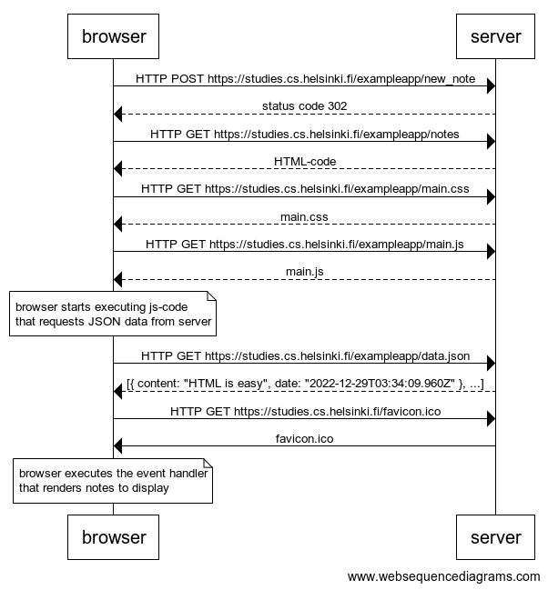
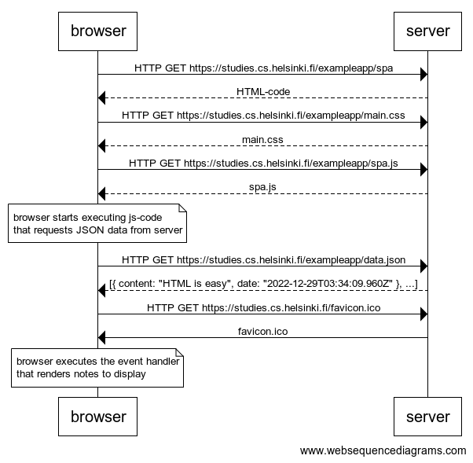
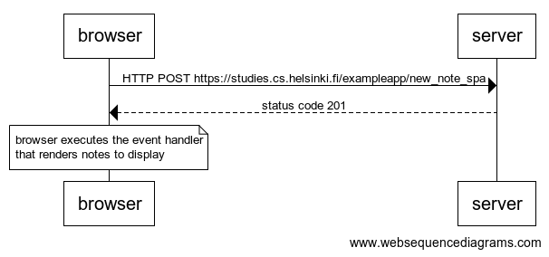

## 0.4: New note diagram

Create a diagram depicting the situation where the user creates a new note on page
https://studies.cs.helsinki.fi/exampleapp/notes when writing something into the text field and clicking the submit button.

### Solution

## 0.5 Single page app diagram

Create a diagram depicting the situation where the user goes to the single page app version of the notes app at https://studies.cs.helsinki.fi/exampleapp/spa.

### Solution

## 0.6 New note in Single page app diagram

Create a diagram depicting the situation where the user creates a new note using the single page version of the app.

### Solution

